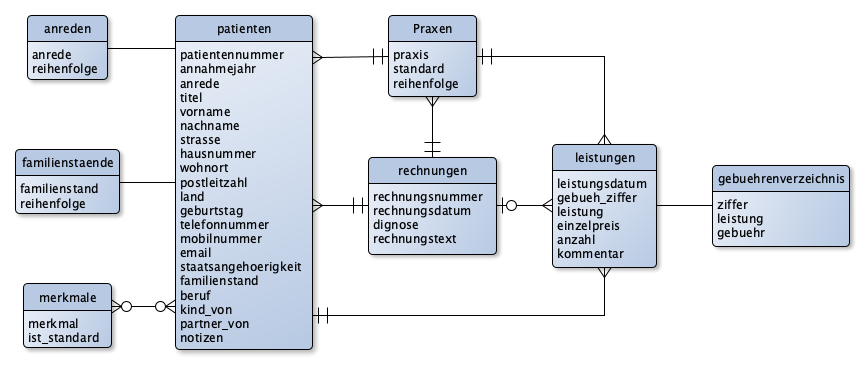

# Use Cases für Naturheilpraxis

## Kontextabgrenzung

Der Heilpraktiker erfasst erbrachte Leistungen für seine Patienten und rechnet
diese ab. Vorlagen für eine Rechnung werden im Dateisystem abgelegt. Rechnungen
können auf eine lokalen Drucker ausgegeben werden.

## Überblick

## Patienten verwalten

__Als Heilpraktiker lege ich einen neuen Patienten an__. Ich erfasse Name,
Anschrift, Kontaktmöglichkeit, Praxis, Annahmejahr, Geburtsdatum und weitere
Informationen. Die Praxis ist mit der Standardpraxis vorbelegt. Das Annahmejahr
ist mit dem aktuellen Jahr vorbelegt. Als Merkmale sind Standardmerkmale
vorausgewählt. Um Duplikate beim Anlegen zu vermeiden, wird vor dem Sichern nach
vorhandenen Patienten mit dem selben Vor- und Nachnamen sowie Geburtstag
gesucht. Existiert ein solcher Patient wird vor dem sichern nachgefragt, ob der
neue Patient wirklich angelegt werden soll.

__Als Heilpraktiker bearbeite ich einen vorhanden Patienten.__ Als erstes muss
ich den _Patient suchen_. Zum Bearbeiten wird der Patient aus der Liste
ausgewählt. Alle Informationen die beim Anlegen erfasst werden, können geändert
werden.

## Diagnose stellen

__Als Heilpraktiker stelle ich eine Diagnose für einen Patienten.__ Zunächst
muss der Patient ausgewählt werden, für den eine Diagnose gestellt wird. Dies
erfolgt mit _Patient suchen_. Aus der Liste wird der gesuchte Patient
ausgewählt. Es werden alle bisher gestellten Diagnosen aufgelistet. Beim Stellen
einer Diagnose werden Diagnosedatum und Diagnosetext erfasst.

__Als Heilpraktiker bearbeite ich eine Diagnose für einen Patienten.__  Als
erstes muss ein Patient mit _Patient suchen_ ausgewählt werden. Eine Diagnose
kann nur bearbeitet werden, wenn sie noch in keiner Rechnung verwendet wird.

__Als Heilpraktiker lösche ich eine Diagnose für einen Patienten.__ Als erstes
muss ein Patient mit _Patient suchen_ ausgewählt werden. Eine Diagnose kann nur
gelöscht werden, wenn sie noch in keiner Rechnung verwendet wird.

## Leistungen erfassen

__Als Heilpraktiker erfasse ich erbrachte Leistungen für einen Patienten.__
Zunächst muss der Patient ausgewählt werden, für den Leistungen erfasst werden.
Dies erfolgt mit _Patient suchen_. Aus der Liste wird der gesuchte Patient
ausgewählt. Es werden alle bisher erbrachten Leistungen aufgelistet. Beim
Anlegen einer Leistung werden die Informationen aus dem Gebührenverzeichnis für
Heilpraktiker in die Leistung kopiert, damit die Leistung nicht geändert wird,
wenn das Gebührenverzeichnis aktualisiert wird.

__Als Heilpraktiker bearbeite ich eine erbrachte Leistungen für einen
Patienten.__ Als erstes muss ein Patient mit _Patient suchen_ ausgewählt werden. Nur eine noch nicht abgerechnete Leistung kann bearbeitet werden.

__Als Heilpraktiker lösche ich eine erbrachte Leistungen für einen Patienten.__
Als erstes muss ein Patient mit _Patient suchen_ ausgewählt werden. Nur eine
noch nicht abgerechnete Leistung kann gelöscht werden.

__Als Heilpraktiker bearbeite ich das Gebührenverzeichnis für Heilpraktiker.__
Es werden die Gebühren aufgelistet. Für eine Gebühr kann Ziffer, Leistung und Gebühr bearbeitet werden. Eine neue Gebühr kann angelegt werden. Eine
bestehende Gebühr kann gelöscht werden.

## Rechnung schreiben

__Als Heilpraktiker erstelle ich eine Rechnung für erbrachte Leistungen eines
Patienten.__ Als erstes muss ein Patient mit _Patient suchen_ ausgewählt werden.
Aus der Liste der noch nicht abgrechneten Leistungen für den Patienten werden
die Leistungen für die zu erstellende Rechnung ausgewählt. Dabei wird die
aktuelle Rechnungssumme berechnet und angezeigt. Es wird eine Rechungsnummer
generiert aus Patient-ID und Rechnungsdatum. Das Rechnungsdatum wird mit dem
aktuellen Datum vorbelegt. Für jede weitere Rechnug wird das jeweils letzte
Rechnungsdatum übernommen. Die Praxis muss ausgewählt werden. Der Rechnungstext
ist mit Zahlungsziel und Kontoverbindung vorbelegt. Optional kann eine Diagnose
angegeben werden.

__Als Heilpraktiker annuliere ich eine bestehende Rechnung.__ Als erstes muss
ein Patient mit _Patient suchen_ ausgewählt werden. Aus der Liste der gestellten
Rechnungen wird die zu annulierende Rechnung ausgewählt. Auf Nachfrage kann die
Rechnung annulliert werden. Dabei werden alle mit der Rechnung verbundenen
Leistungen wieder als nicht abgerechnet betrachtet und die annulierte Rechnung
gelöscht.

__Als Heilpraktiker drucke ich eine bestehende Rechnung.__ Als erstes muss ein
Patient mit _Patient suchen_ ausgewählt werden. Aus der Liste der gestellten
Rechnungen wird die zu druckende Rechnung ausgewählt. Für ausgewählte Rechnung
muss vor dem Drucken entschieden werden, ob die Leistungsbezeichhnung auf der
Rechnung erscheinen soll oder nicht. Gedruckt wird eine Rechnung mit Briefkopf,
persönlicher Anrede, Diagnose falls vorhanden, der Liste der Leistungen, der
Rechnungssumme und dem Rechnungstext.

## Patient suchen

__Als Heilpraktiker suche ich einen bestimmten Patienten.__ Um den Patienten zu
finden kann nach Patienten-ID, Nachname, Vorname, Geburtstag, Straße, Wohnort,
Postleitzahl, Telefonnummer und Annahmejahr gesucht werden. Die Liste der
gefundenen Patienten kann nach jeder Spalte sortiert werden. Die
Standardsortierung ist nach Patienten-ID. Ohne Suchkritierium, werden alle
Patienten in der Liste aufgeführt.

## Rechnung suchen

__Als Heilpraktiker suche ich eine bestimmte Rechnung.__ Um die Rechnung zu
finden kann nach Rechnungs-ID, Praxis, Rechnungsnummer, Rechnungsdatum,
Patient-ID, Vorname, Nachname, Geburtsdatum, Wohnort, Rechnungstext und
Diagnise gesucht werden. Die Liste der gefundenen Rechnungen kann nach jeder
Spalte sortiert werden. Die Standardsortierung ist nach Rechnungsnummer. Ohne
Suchkritierium, werden alle Rechnungen eines Patienten in der Liste aufgeführt.
Alternativ können alle Rechnungen aller Patienten aufgelistet werden.

## Schema

